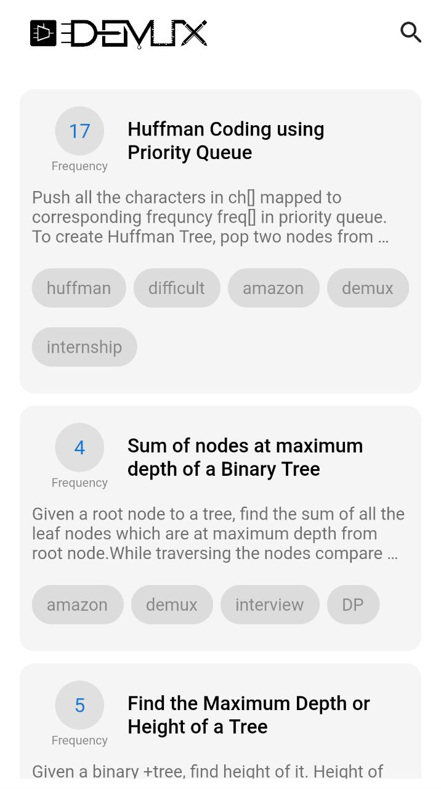
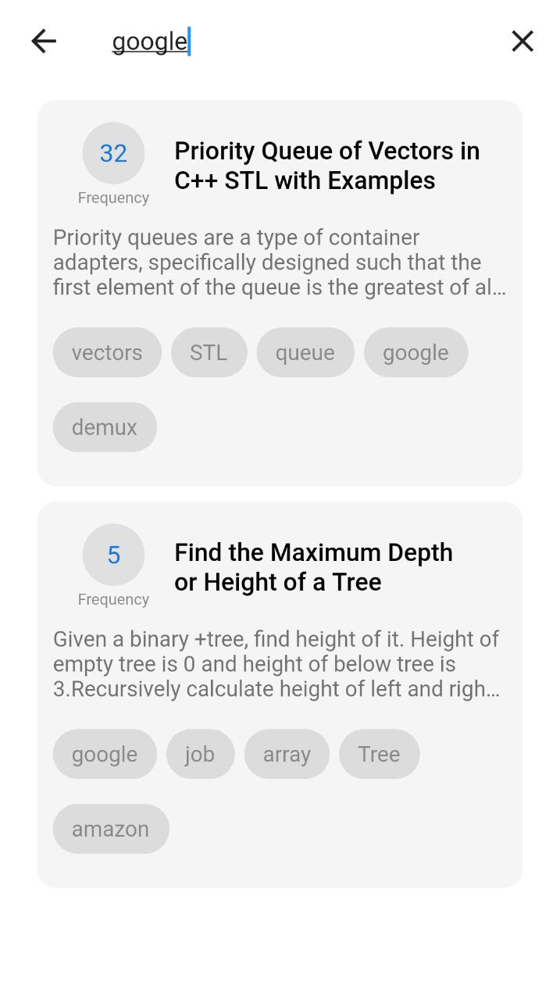

# **Demux Assignment**

## How to Use

**Step 1:**

Download or clone this repo by using the link below:

```
https://github.com/praveen4030/DemuxSolution
```

**Step 2:**

Go to project root and execute the following command in console to get the required dependencies: 

```
flutter pub get
```

**Step 3:**

This project uses `inject` library that works with code generation, execute the following command to generate files:

```
flutter packages pub run build_runner build --delete-conflicting-outputs
```

or watch command in order to keep the source code synced automatically:

```
flutter packages pub run build_runner watch
```

**Step 4:**
Connect the USB or run emulator to run it in debug mode.

or you can run this command to generate the apk yourself.

```
flutter build apk --target-platform android-arm,android-arm64,android-x64 --split-per-abi
```

## File Structure
This repoitory follows Data Driven Design Strcuture.
In this structure, all the code is divided into four layers each being independent of each other.

- Application
- Domain
- Infrastructure
- Presentation


## Application

This layers contains all the business logic and stores all the blocs.
This layer is completely independednt of infrastructure layer and just contacts with Presentation and Domain Layer.

## Domain

This layer is in contact with Application and Infrastructure layer where we defines all the validation,model classes, abstract classes to be completed in infrastructure layer etc.

## Infrastructure

This layer contains all the backend related code that is related to API,
lets say if in future we wishes to move on AWS from firebase
then we need to touch only this layer.

## Presentation

This layer contains all the screen i.e. UI/UX part will be there and will remain in contact with application layer only.

- [For more info on DDD](https://www.youtube.com/watch?v=RMiN59x3uH0&list=PLB6lc7nQ1n4iS5p-IezFFgqP6YvAJy84U)

## Assignment details

I have implemented this project using Firebase Cloud Firestore. Here users can view all the questions which will be fetched 5 at a time then fetching more on scrolling down.

Question will contain

- Title
- Frequency
- Detail
- Trending
- Tags
- Timestamp

User can also search for the question on the basis of Tags.

## Major Packages Used

- GetIt
: It is used to inject the blocs, classes.

- Linting
 : Linting is exhaustively used in this project to improve the code quality and improve the speed.

- Bloc
 : It is used for better state management to keep the business logic seperately from UI.

- Auto Route
 : It is used to reduce the boiler plate code in routing and to access to awesome features provided by this package

## APK
You can find the apk to test it inside APK folder

## Screen shots

<!--   -->

Splash Page | Home Page | Search Page 1 | Search Page 2
:-------------------------:|:-------------------------:|:-------------------------:|:-------------------------:
|||